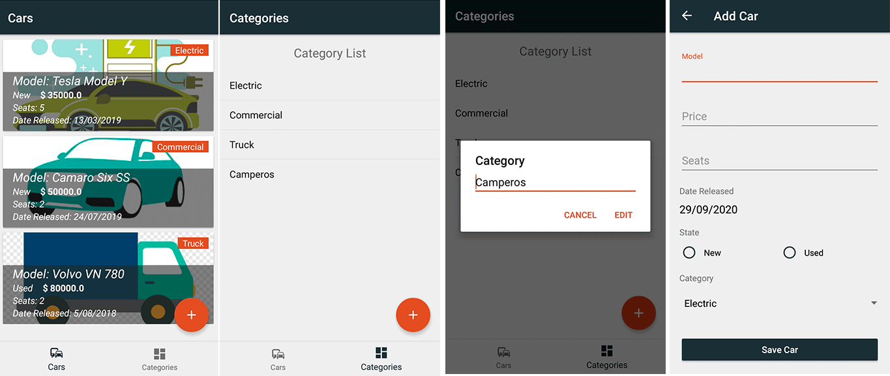

# CarShop

The project consisting of main screens, which manages the carts and categories, has been carried out. Data storage is worked with SQLite using a library that facilitates the work called Sugar

## Car store app

### Requirements

Design a car shop app that should save all the cars in the shop. Information should be saved for each car in the following

- [x] Number of seats
- [x] Price
- [x] It’s new or used
- [x] Model
- [x] Date released
- [x] Category:
  - [x] Just can be Electric, truck or commercial
  - [x] If electric car, the app must save battery capacity
  - [x] If it is a truck, the app must save it has a max available payload
  - [x] And if it is commercial, the app must save space capacity
  - [x] All vehicle can be saved, modified and read, except to electric car, this cannot be modified.
  - [x] The application must be able to create more categories
  
## Application development

For the development of this application we have chosen to use Kotlin as a programming language.
The main screen consists of a bottom Navigation with 2 items, which are the carts and the categories, each one consists of fragments where the list of both elements is included. The design of the application in the following:

The background image in the CardView was placed based on the default category, leaving this option to change the image if you choose to place the car image.
